# Tugas Modul 4

## 1. Topologi Jaringan

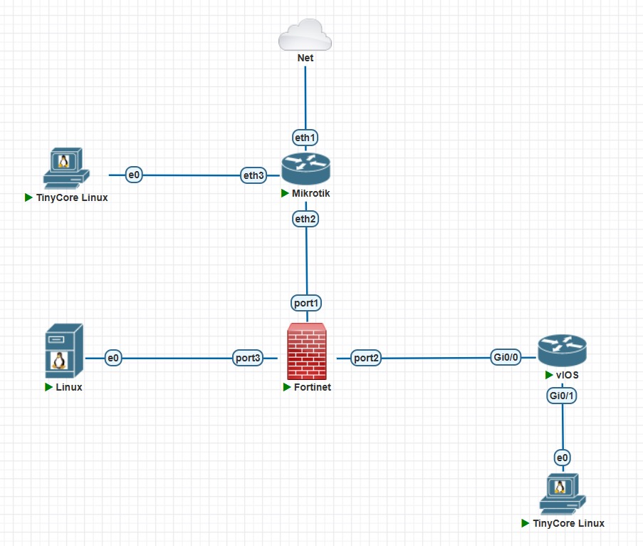

## 2. Tabel IP Address

| Perangkat | Interface | IP Address | Keterangan |
|------------|------------|------------|------------|
| MikroTik | ether1 | DHCP Client | Terhubung ke Cloud |
| MikroTik | ether2 | 10.10.10.1/30 | Ke FortiGate |
| MikroTik | ether3 | 172.16.100.1/24 | Ke WAN Client |
| FortiGate | port1 | 10.10.10.2/30 | WAN |
| FortiGate | port2 | 10.20.20.1/30 | INSIDE |
| FortiGate | port3 | 192.168.20.1/24 | DMZ |
| Cisco Router | Gi0/0 | 10.20.20.2/30 | Ke FortiGate |
| Cisco Router | Gi0/1 | 192.168.10.1/24 | LAN Gateway |
| Client LAN | eth0 | 192.168.10.10/24 | Host LAN |
| Server DMZ | eth0 | 192.168.20.10/24 | Web Server |
| Client WAN | eth0 | 172.16.100.10/24 | Host WAN |

## 3. Konfigurasi Tiap Perangkat

### 3.1 Mikrotik

MikroTik dikonfigurasi sebagai router ISP dengan DHCP Client pada interface ether1, IP address pada ether2 dan ether3, NAT masquerade, serta static route menuju jaringan LAN dan DMZ.

Konfigurasi IP Address, Routing, NAT

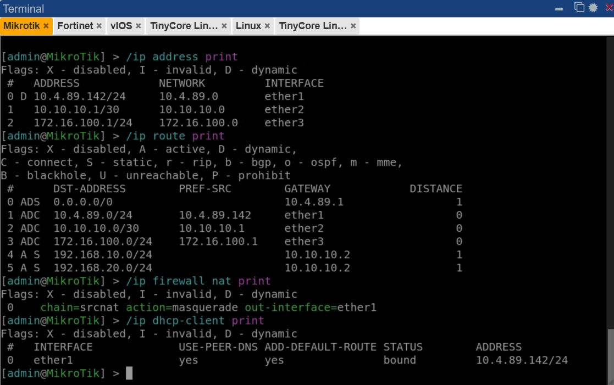

### 3.2 Fortigate

FortiGate dikonfigurasi dengan tiga interface, yaitu WAN (port1), INSIDE (port2), dan DMZ (port3). Selain itu ditambahkan static route, firewall policy, dan Virtual IP (VIP).

Konfigurasi Interface

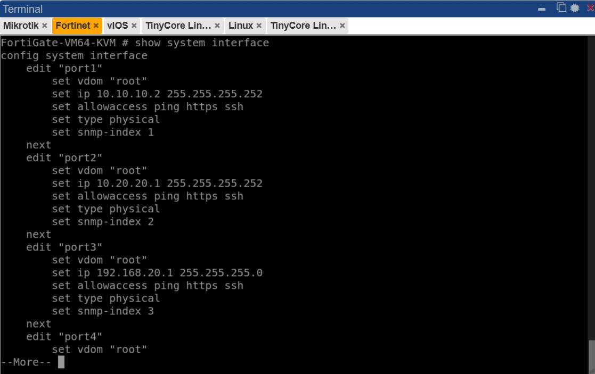

Konfigurasi Routing

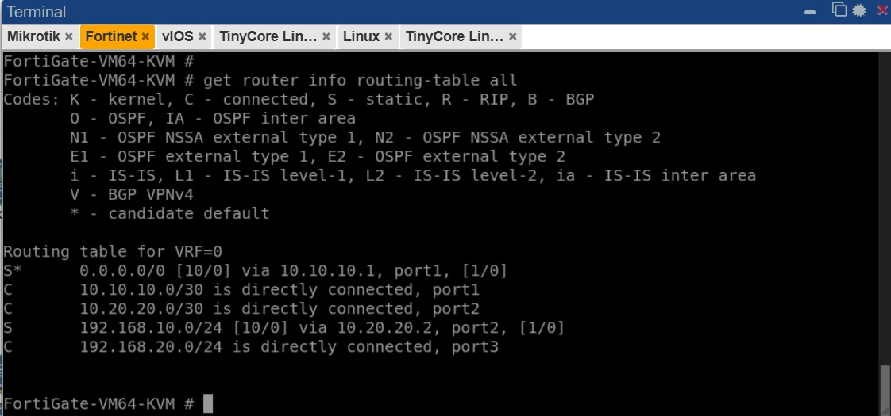

Konfigurasi Firewall Policy

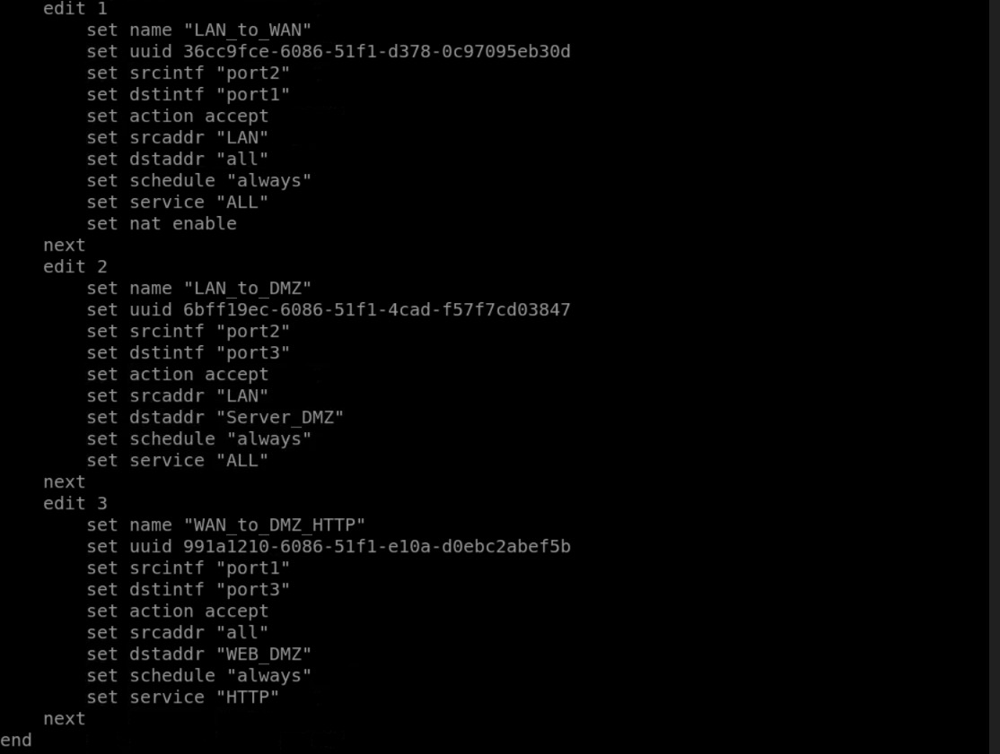

Konfigurasi VIP

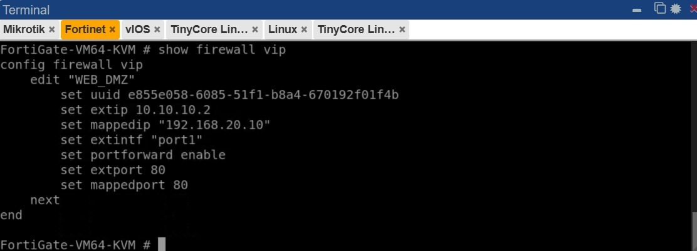

### 3.3 Cisco Router

Cisco Router dikonfigurasi sebagai gateway jaringan LAN dengan alamat IP pada interface GigabitEthernet0/0 dan GigabitEthernet0/1 serta default route menuju FortiGate.

Konfigurasi Interface

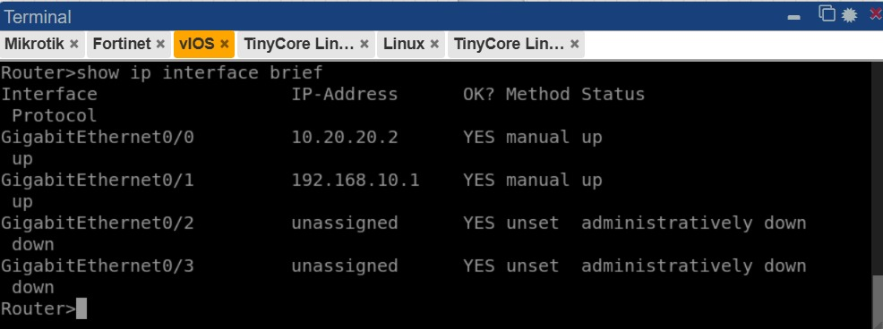

Konfigurasi Routing

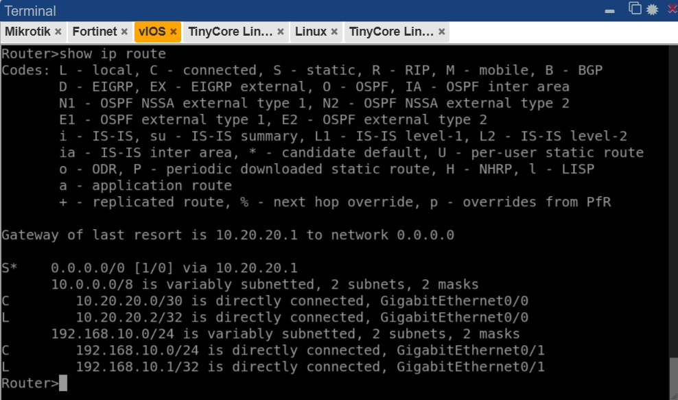

### 3.4 Client 

Client LAN

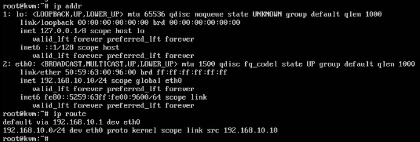

Client WAN

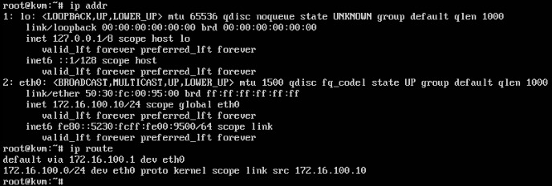

## 4. Hasil Pengujian

### 4.1 Pengujian client lan ke gateway cisco

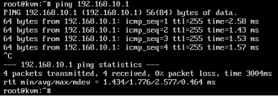

### 4.2 Pengujian client lan ke fortigate

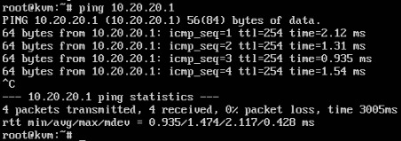

### 4.3 Pengujian client lan ke DMZ

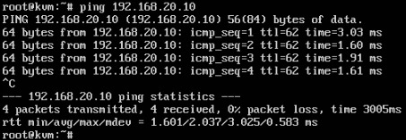

### 4.4 Pengujian client lan akses ip dmz

### 4.5 Pengujian client wan ping ke isp mikrotik

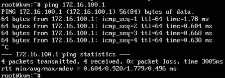

### 4.6 Penujian client wan ping ke fortigate

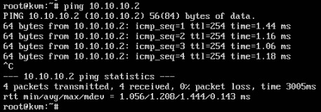

### 4.7 Pengujian client wan akses http://10.10.10.2

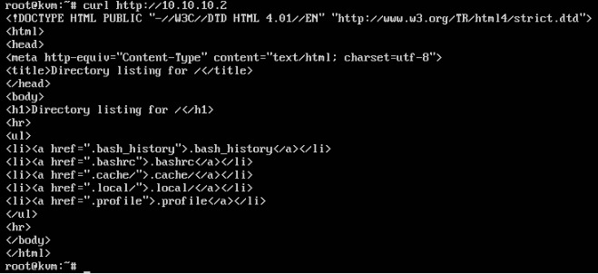

### 4.8 Pengujian client wan ping client lan

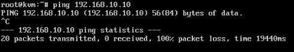

### 4.9 Pengujian client wan ping IP asli DMZ

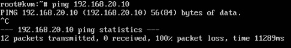

### 4.10 Pengujian server dmz ping lan

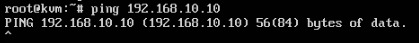
