# Tugas Modul 5

## 1. Konfigurasi Cisco Switch Jakarta

## 2. Konfigurasi Cisco Router Jakarta

## 3. Konfigurasi MikroTik Router Jakarta

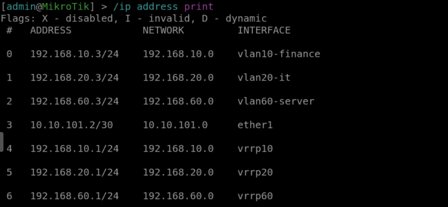
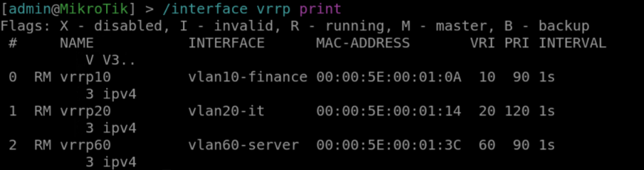
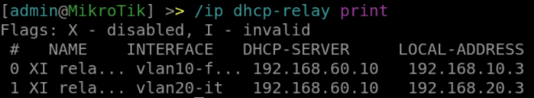
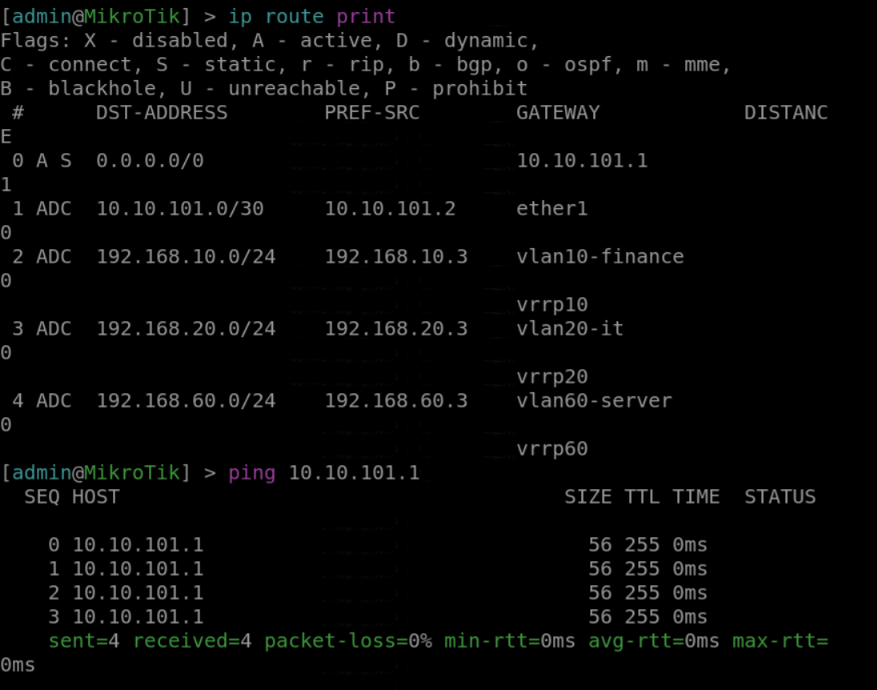

## 4. Konfigurasi Ubuntu Server Jakarta

## 5. Konfigurasi FortiGate Jakarta

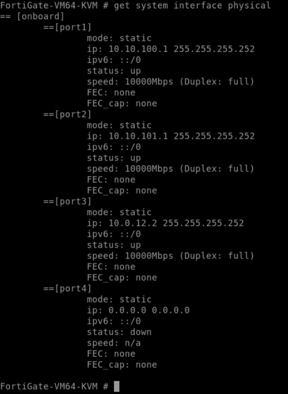
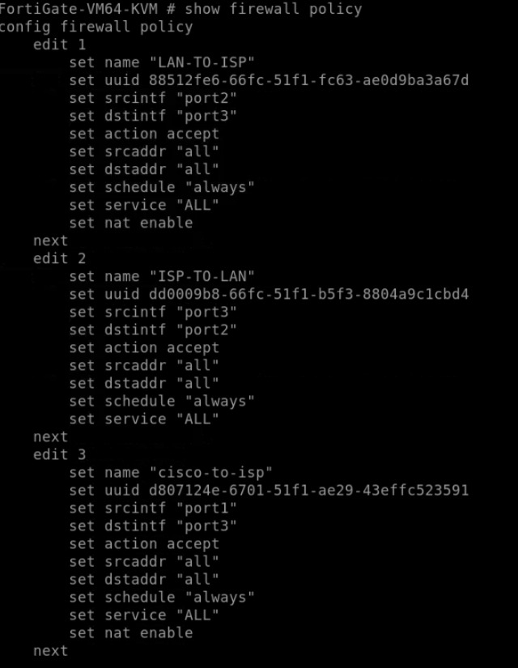
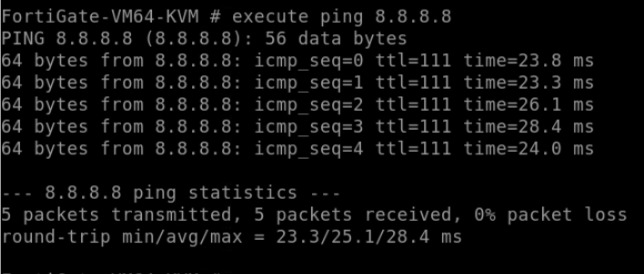

## 6. Konfigurasi MikroTik ISP

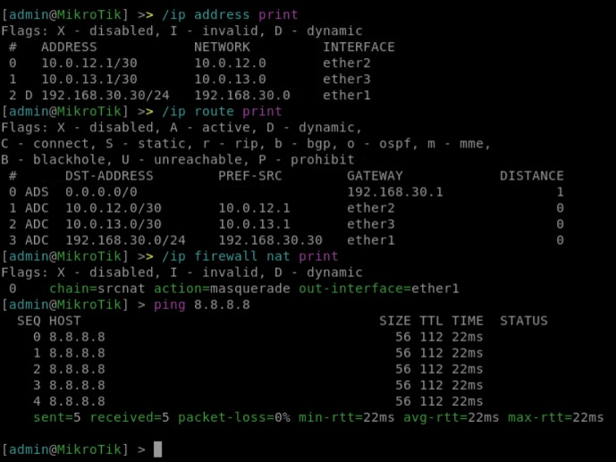

## 7. Konfigurasi Switch dan MikroTik Surabaya

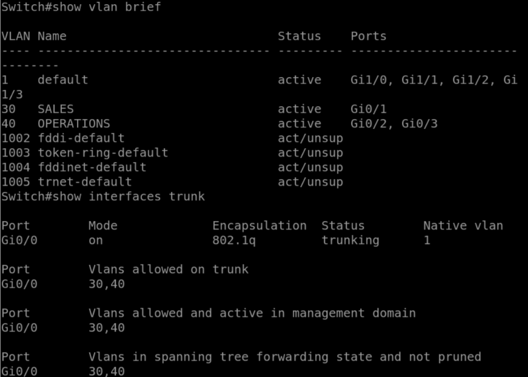
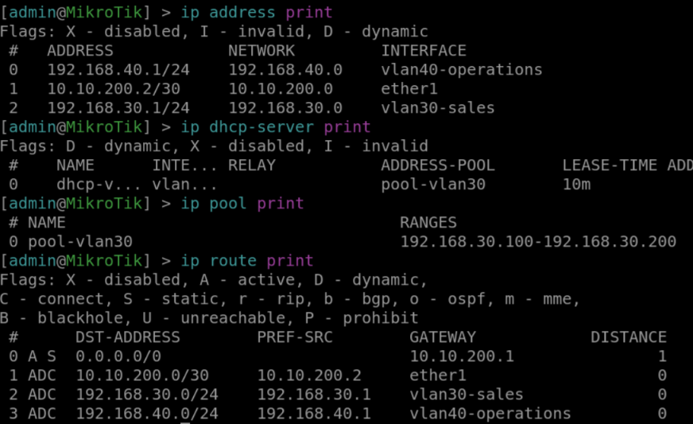
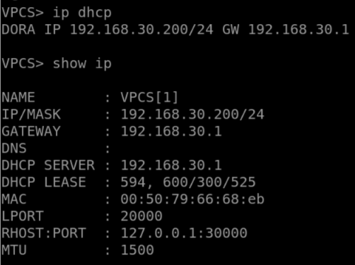
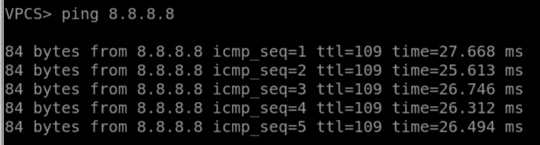
